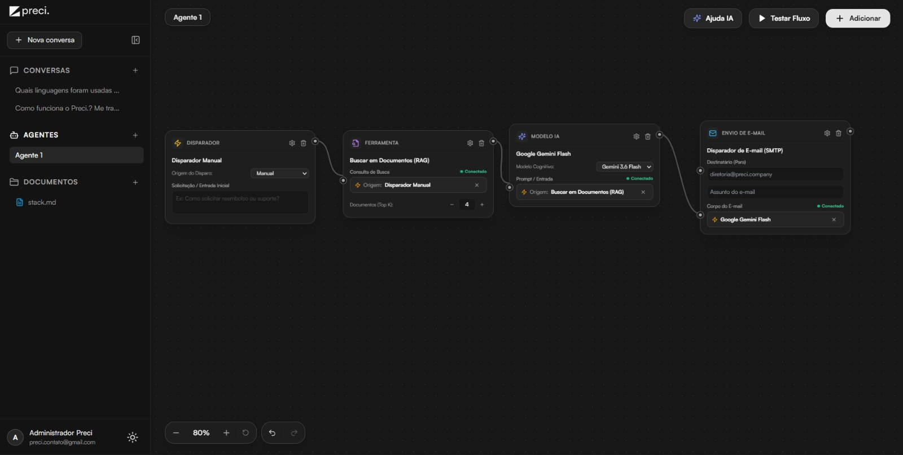
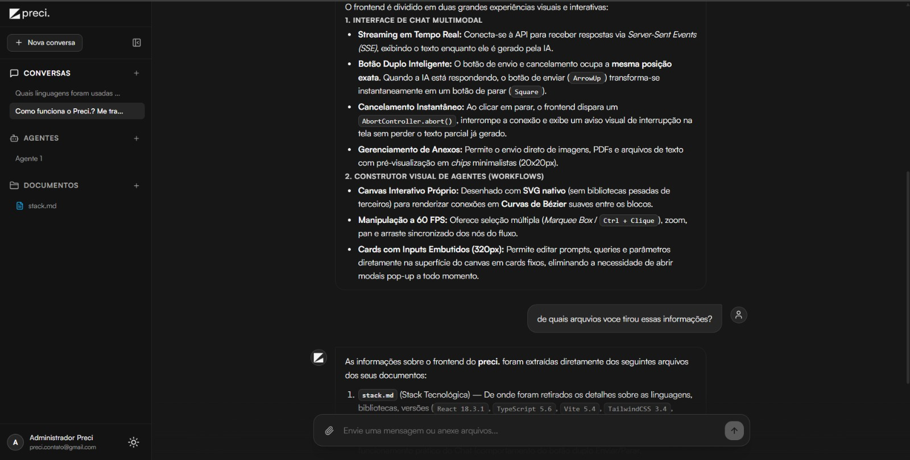
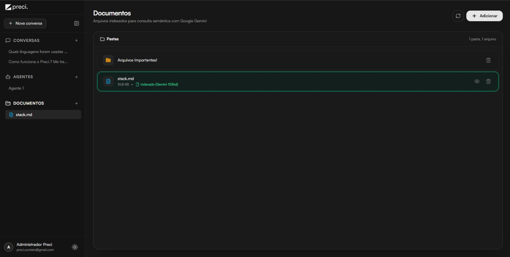
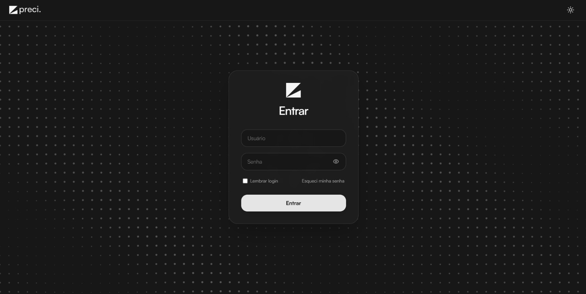
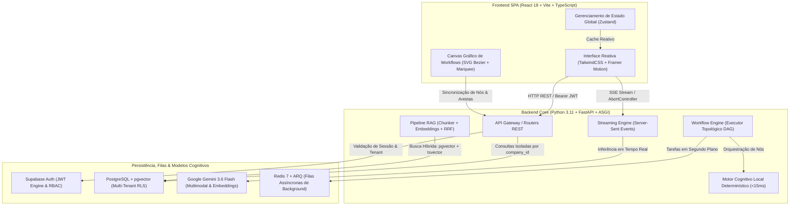
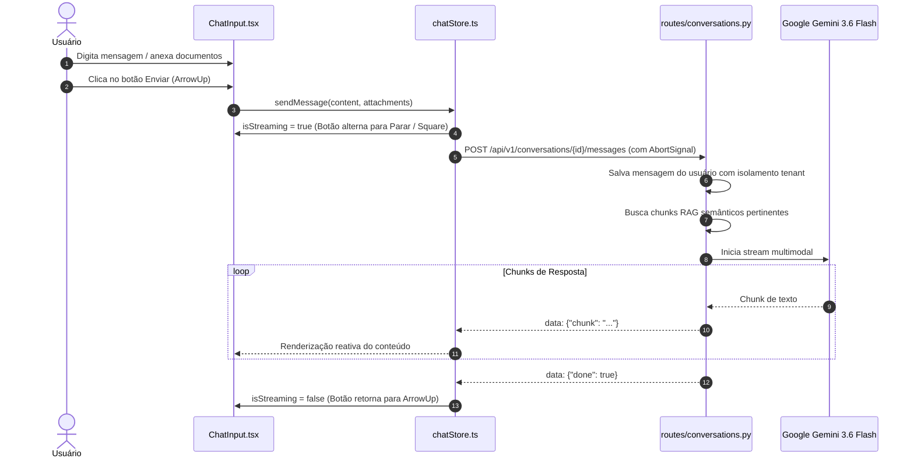
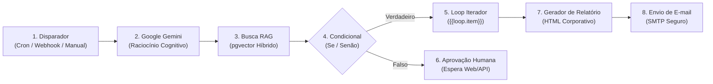
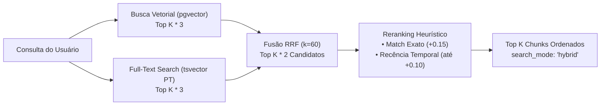

<div align="center">

  
  

  <br />
  <br />

  <p align="center">
    <strong>Precisão que move o seu negócio.</strong>
  </p>

  <p align="center">
    Plataforma unificada multi-tenant de <strong>Inteligência Artificial Corporativa</strong>, <strong>Orquestrador Visual de Agentes e Workflows (DAG)</strong> e <strong>Gestão de Conhecimento com RAG Híbrido (pgvector + tsvector)</strong>. Projetada com foco em alta performance, isolamento estrito de dados corporativos e experiência visual moderna.
  </p>

  <p align="center">
    <!-- Badges de Tecnologias Principais -->
    
    
    
    
    
    
    
    
    
    
  </p>

  <p align="center">
    <a href="#-visão-geral">Visão Geral</a> •
    <a href="#telas-da-plataforma">Telas da Plataforma</a> •
    <a href="#-arquitetura-do-sistema">Arquitetura</a> •
    <a href="#-módulos-da-plataforma">Módulos</a> •
    <a href="#-design-system--uiux">Design System</a> •
    <a href="#-segurança--multi-tenancy">Segurança</a> •
    <a href="#-stack-tecnológica">Stack</a> •
    <a href="#-execução-local">Execução</a> •
    <a href="#-licença--propriedade-intelectual">Licença</a>
  </p>

</div>

---

> [!IMPORTANT]
> **Aviso de Portfólio & Demonstração**: Este repositório foi publicado como projeto de portfólio de engenharia de software full-stack e arquitetura de sistemas de IA. O código, os designs e os fluxos representam soluções autorais protegidas por direitos autorais. Nenhuma chave de produção, banco de dados ou segredo comercial está contido neste repositório.

---

## 🌟 Visão Geral

A plataforma **preci.** foi desenvolvida para resolver a fragmentação que existe nas ferramentas de produtividade corporativa com IA. Em vez de utilizar soluções isoladas para conversas com LLMs, ferramentas separadas para automações e sistemas legados de armazenamento de arquivos, a **preci.** consolida essas três frentes em uma experiência unificada:

1. **Conversas Inteligentes Multimodais**: Chat corporativo com streaming em tempo real via Server-Sent Events (SSE), suporte a anexos (PDFs, imagens) e cancelamento sob demanda (*Stop Generation*) sem perda de contexto.
2. **Construtor Visual de Agentes & Workflows (estilo n8n)**: Canvas interativo sem dependências pesadas, com curvas Bézier, inputs embutidos diretamente nos cards, conexão handle-to-field e 11 nós especializados orientados a grafo acíclico dirigido (DAG).
3. **Gestão Documental & RAG Híbrido Corporativo**: Indexação vetorial com `pgvector`, busca textual em português via `tsvector`, fusão de rankings via *Reciprocal Rank Fusion (RRF k=60)* e reranking heurístico com boost de match exato e recência.
4. **Isolamento Estrito Multi-tenant**: Garantia de privacidade de ponta a ponta com Row Level Security (RLS) no PostgreSQL e autenticação JWT gerenciada pelo Supabase Auth.

---

<a id="telas-da-plataforma"></a>
## 📸 Telas da Plataforma

Confira a interface visual moderna e monocromática da plataforma em funcionamento:

<div align="center">

| 🤖 [Construtor de Workflows (DAG)](#workflows-dag) | 💬 [Chat Multimodal & Streaming](#chat-multimodal) |
| :---: | :---: |
| <a href="#workflows-dag"></a><br /><sub><strong>Orquestrador Visual de Workflows (DAG)</strong>: Canvas interativo com curvas Bézier, inputs embutidos nos cards e execução em tempo real.</sub> | <a href="#chat-multimodal"></a><br /><sub><strong>Conversas Inteligentes Multimodais</strong>: Streaming contínuo via SSE, citações automáticas da base RAG e cancelamento instantâneo.</sub> |
| 📁 [Gestão Documental & RAG](#gestao-documentos) | 🔐 [Autenticação & Halftone Canvas](#engenharia-visual) |
| <a href="#gestao-documentos"></a><br /><sub><strong>Gestão Documental & Base RAG</strong>: Indexação vetorial com Google Gemini (1536d), busca híbrida e organização por pastas.</sub> | <a href="#engenharia-visual"></a><br /><sub><strong>Autenticação & Halftone Canvas</strong>: Malha matemática vetorial reativa com repulsão ao cursor do mouse a 60 FPS.</sub> |

</div>

---

## 🏛️ Arquitetura do Sistema

A aplicação adota o padrão de arquitetura desacoplada SPA + REST/SSE, com comunicação assíncrona e execução resiliente em múltiplas camadas:



---

## 📦 Módulos da Plataforma

<a id="chat-multimodal"></a>
### 💬 1. Conversas Inteligentes (Chat Multimodal & Streaming)

<div align="center">
  
  <p align="center"><em>Interface de Chat corporativo: streaming em tempo real via SSE, citações de documentos indexados e controle dinâmico de interrupção (Stop Generation).</em></p>
</div>

- **Motor Google Gemini 3.6 Flash**: Raciocínio rápido com alta capacidade de contexto e geração com streaming contínuo via Server-Sent Events (SSE).
- **Botão Duplo de Envio / Interrupção (Stop Generation)**:
  - O botão de ação no rodapé do chat ocupa a **mesma coordenada física**:
    - **Modo Envio (`ArrowUp`)**: Dispara a mensagem e anexos.
    - **Modo Parar (`Square`)**: Surge instantaneamente durante a transmissão da resposta da IA.
  - Ao clicar em Parar, a conexão com a LLM é cancelada via `AbortController.abort()`, preservando o texto parcial gerado até aquele milissegundo.
- **Aviso de Interrupção no Lado da LLM**:
  - Quando o usuário cancela o envio, o balão de resposta exibe feedback visual com ícone de Stop e aviso sutil:
    > ⏹ *Envio de mensagem interrompida pelo Usuário*
- **Animação de Mola de Abertura (Spring Physics)**: Campo de digitação centralizado na tela de boas-vindas com transição fluida para o rodapé via Framer Motion (`stiffness: 260`, `damping: 28`) após o primeiro envio.
- **Renderização Rica de Markdown**: Suporte completo a formatação GitHub Flavored Markdown (títulos, negrito, itálico, listas, tabelas estruturadas com bordas, citações em bloco e código inline/blocos com destaque de sintaxe via `react-markdown` e `remark-gfm`).
- **Anexos de Chat Desacoplados**: Envio direto de imagens (PNG, JPG, WebP) e PDFs vinculados estritamente à conversa corrente, sem poluir a base de documentos global.



---

<a id="workflows-dag"></a>
### 🤖 2. Construtor Visual de Agentes & Workflows (DAG)

<div align="center">
  
  <p align="center"><em>Canvas gráfico nativo (SVG Bezier): cards com inputs embutidos (320px), conexões handle-to-field, controle de zoom dinâmico e 11 nós especializados.</em></p>
</div>

O módulo de workflows da **preci.** é um editor visual de grafos desenvolvido do zero sem bibliotecas pesadas de terceiros (construído com React nativo + SVG), garantindo 60 FPS estáveis mesmo em grafos com centenas de elementos:



#### Características do Canvas:
- **Cards com Inputs Embutidos (320px)**: Prompts, queries de busca, URLs e parâmetros editáveis diretamente na superfície do canvas, sem forçar abertura contínua de modais.
- **Conexão Direta entre Portas (Handles)**: Cabos ligam saídas (`output`, `true`, `false`, `loop_body`, `loop_complete`, `approved`, `rejected`) diretamente às portas receptoras (`prompt`, `query`, `raw_data`, `body`, `to`, `message`).
- **Controle de Zoom Dinâmico**: Viewport dimensionável de 40% a 200% com indicador inline, redefinição rápida com 1-clique (`100%`) e atalhos (`Ctrl +`, `Ctrl -`, `Ctrl + Wheel`).
- **Marquee Selector (Desktop OS)**: Seleção em bloco por clique e arrasto no fundo do canvas, com cálculo geométrico no espaço do mundo e movimentação síncrona em grupo acelerada por GPU.
- **Badge Flutuante de Ações**: Animação bidirecional suave de entrada e saída (`.badge-spring-transition`, 220ms com curva cúbica), fornecendo feedback tátil imediato (`active:scale-95`).
- **Zero Eval & Injeção Segura**: Parser de substituição de variáveis determinístico sem funções inseguras de execução arbitrária (`eval()`).

#### 11 Tipos de Nós Especializados:

| Ícone | Tipo de Nó | Descrição Técnica | Portas de Entrada | Portas de Saída |
| :---: | :--- | :--- | :--- | :--- |
| ⚡ | **Trigger** | Ponto de partida: manual com parâmetros, webhook HTTP ou **agendamento recorrente (cron)** com seletor visual em português. | *(Início do fluxo)* | `output` |
| 🧠 | **Modelo IA** | Executa inferência com o modelo `gemini-3.6-flash`, system instructions e parâmetros de temperatura. | `prompt` | `output` |
| 📚 | **Busca em Documentos** | RAG híbrido (`pgvector` + `tsvector`) com seletor de pasta do usuário, limiar de similaridade e stepper de Top K. | `query` | `output` |
| 🔀 | **Condicional** | Bifurcação lógica (`==`, `!=`, `>`, `<`, `contains`, `not_empty`) para direcionamento do fluxo. | `value` | `true`, `false` |
| 🔁 | **Loop (Iterador)** | Itera coleções/arrays com injeção de `{{loop.item}}` e `{{loop.index}}`, com arestas tracejadas `loop_back` imunes a falsos-positivos de ciclo DAG. | `items` | `loop_body`, `loop_complete` |
| 👤 | **Aprovação Humana** | Pausa o fluxo, serializa o estado no banco de dados e aguarda aprovação manual via interface ou API REST. | `input_data` | `approved`, `rejected` |
| 🧩 | **Sub-Agente** | Composição modular: dispara outro workflow salvo como etapa encapsulada com proteção anti-recursão (profundidade máx. 3). | `input_data` | `output` |
| 📄 | **Gerador de Relatórios** | Transforma JSON ou texto em relatórios HTML corporativos monocromáticos elegantes com sandbox de pré-visualização. | `raw_data` | `output` |
| ✉️ | **Envio de E-mail** | Disparo de mensagens e relatórios via SMTP seguro com modo de simulação/sandbox para testes. | `to`, `body` | `output` |
| 🌐 | **Requisição HTTP** | Chamadas REST externas (GET, POST, PUT, DELETE) com cabeçalhos estruturados e timeout calibrado. | `body` | `output` |
| 🔔 | **Ação / Notificação** | Disparo de alertas para webhooks corporativos (Slack, Discord, sistemas legados). | `message` | `output` |

#### Motor Cognitivo Local & Teste de Fluxo (Cota Zero):
- **Execução Real sem Consumo de Cota**: Para ambientes de desenvolvimento e testes rápidos, o backend conta com um **motor de inferência determinística local** implementado em Python nativo.
- **Baixíssimo Consumo**: Ocupa < 2 MB de RAM, dispensa GPU/VRAM e processa nós com latência inferior a 15ms.
- **Inspetor de Execução em 3 Abas**:
  1. *Resultado Gerado*: Renderização final do output em Markdown ou JSON com métricas de tempo.
  2. *Inspetor de Nós (I/O)*: Lista detalhada de cada nó com snapshots exatos de entrada (`input`), saída (`output`), latência individual e status.
  3. *Logs do Workflow*: Terminal de telemetria detalhada de cada etapa da execução.

---

<a id="gestao-documentos"></a>
### 📁 3. Gestão de Documentos & Pipeline RAG Híbrido

<div align="center">
  
  <p align="center"><em>Gestão documental corporativa: categorização em pastas, preview instantâneo de arquivos e indexação vetorial com Google Gemini (1536d).</em></p>
</div>

A plataforma implementa um pipeline corporativo de RAG de alta precisão que combina busca vetorial semântica profunda com busca textual full-text nativa do PostgreSQL e reranking heurístico leve:



1. **Ingestão & Chunking**:
   - Extração de texto de PDFs em memória via `pypdf` sem gravar arquivos temporários em disco.
   - Particionamento em chunks de 400 caracteres com sobreposição de 40 caracteres (`overlap`).
   - Geração de embeddings vetoriais densos de 1536 dimensões (`gemini-embedding-2` / `text-embedding-3-small`) com controle assíncrono de taxa de requisições (`asyncio.sleep(0.4)`).
2. **Busca Híbrida Simultânea**:
   - Disparo concorrente via `asyncio.gather` da busca vetorial (similaridade de cosseno pgvector) e busca textual (função RPC `match_document_chunks_fts` com dicionário `'portuguese'`).
   - Coleta ampliada de candidatos ($K \times 3$).
3. **Fusão por Reciprocal Rank Fusion (RRF, k=60)**:
   - Combinação matemática que independe da escala individual dos escores:
     $$\text{RRF\_score}(c) = \sum_{r \in \{\text{vector\_rank}, \text{text\_rank}\}} \frac{1}{60 + r}$$
4. **Reranking Heurístico**:
   - **Match Exato de Palavra-Chave (+0.15)**: Identifica termos contratuais exatos (ex.: `CLI-98234-XP`), números de processo ou nomes próprios.
   - **Recência Temporal (até +0.10)**: Decaimento exponencial com meia-vida calibrada para 90 dias com base no `updated_at` do documento pai.
5. **Pop-up de Preview Rápido pelo Ícone de Olho (`Eye`)**:
   - O clique no corpo da linha do documento apenas seleciona o item.
   - A abertura do modal de visualização ocorre exclusivamente ao clicar no ícone de Olho, permitindo ler o texto extraído, metadados e pré-visualizar documentos.

---

### 📑 4. Menu Lateral Inteligente (Sidebar)

- **Comportamento Responsivo**: Alternância suave entre modo expandido (256px / `w-64`) e recolhido (64px / `w-16`) com transição de 300ms.
- **Últimos 5 Documentos Acessados**: Atalho dinâmico para os arquivos mais recentes consultados pelo usuário, com foco direto na pasta e abertura de preview pelo ícone de Olho.
- **Scroll Dinâmico com Limiares Humanizados**:
  - Até 10 conversas: altura natural sem barra de rolagem.
  - Da 11ª conversa em diante: scroll independente automático (`max-h-[302px]`).
  - Até 5 agentes: altura natural.
  - Do 6º agente em diante: scroll independente automático (`max-h-[152px]`).
- **Fixação do Módulo de Documentos**: Botão fixado no rodapé com `shrink-0`, garantindo acesso imediato independentemente do tamanho da lista de conversas.

---

## 🎨 Design System & UI/UX

A identidade visual da **preci.** é governada por um design system minimalista monocromático corporativo, com tipografia moderna e interações físicas calibradas:

```
Dark Mode:  Canvas #131313 │ Cards #171717 │ Bordas #2E2E2E │ Texto #F5F5F5
Light Mode: Canvas #EFEFEF │ Cards #FFFFFF │ Bordas #E5E5E5 │ Texto #171717
```

### 🎯 Conceito da Marca & Identidade Visual (Criação Autoral do Zero)

Toda a identidade visual, naming, logomarcas e design system da plataforma foram **idealizados, concebidos e criados do zero pelo próprio autor no Adobe Illustrator e Adobe Photoshop**, unindo design de produto e engenharia de software de ponta a ponta:

- **O Nome (`preci.`)**:
  - Grafado em letras minúsculas com o **ponto final imediato (`.`)**, simboliza **precisão cirúrgica**, rigor analítico, assertividade e conclusão em cada entrega e processo.
- **O Símbolo & Logomarca (A Rampa Ascendente)**:
  - **Visão Frontal & Futuro**: Uma perspectiva tridimensional que direciona o foco para a frente e para o horizonte estratégico da organização.
  - **Rampa que Leva para Cima (Escalabilidade)**: O plano ascendente representa a capacidade de **escalonar o negócio**, impulsionando resultados e elevando continuamente o patamar de produtividade com Inteligência Artificial.
  - **Precisão nas Decisões**: A geometria precisa e os ângulos retos refletem a solidez e a exatidão que a plataforma confere aos gestores na hora de tomar escolhas cruciais para a empresa.
- **Processo Criativo (Illustrator & Photoshop)**:
  - **Adobe Illustrator**: Construção vetorial rigorosa, alinhamento de nós, proporções áureas e exportação limpa de ícones e logotipos.
  - **Adobe Photoshop**: Refinamento de iluminação, contraste em telas de alta densidade (Retina/OLED) e acabamento monocromático para as versões **Dark Mode** (`PreciLogomarcaLightPNG.png`) e **Light Mode** (`PreciLogomarcaBlackPNG.png`).

<a id="engenharia-visual"></a>
### Destaques de Engenharia Visual:

<div align="center">
  
  <p align="center"><em>Tela de login corporativa minimalista com Halftone Canvas interativo (malha de pontos matemáticos com física de repulsão vetorial ao mouse).</em></p>
</div>

- **Halftone Canvas Interativo (60 FPS)**: Na tela de login, uma malha vetorial de pontos matemáticos reage em tempo real a harmônicos senoidais diagonais superpostos e à repulsão física do cursor do mouse ($140\text{px}$ de raio de ação).
- **Tipografia Satoshi**: Família tipográfica neo-grotesca aplicada em toda a interface, com variante Semi-bold reservada para a marca `preci.`.
- **Componente `NumberInput` Próprio**: Erradicação total dos controles numéricos nativos brancos do navegador, com steppers em cápsula monocromática (`chevrons` e `stepper`).
- **Diretriz Strict No-Emoji**: 100% dos ícones da aplicação provêm exclusivamente de vetores SVG profissionais (**Lucide React**), mantendo a sobriedade corporativa.

---

## 🔐 Segurança & Multi-Tenancy

- **100% Autenticação Supabase Auth**: Zero senhas em plain text no backend, zero usuários hardcoded e zero backdoors. Tokens JWT assinados e validados a cada requisição.
- **Isolamento Estrito por Tenant (`company_id`)**: Cada tabela do banco de dados (`conversations`, `messages`, `documents`, `document_folders`, `agents`, `executions`) possui a coluna `company_id`.
- **PostgreSQL Row Level Security (RLS)**: Políticas ativas no banco que impedem que um usuário acerte consultas fora do escopo da sua organização.
- **Proteção contra Injeção de Código**: O motor de interpolação de variáveis e o avaliador condicional operam por análise léxica determinística, **sem uso de `eval()`**.

---

## 🛠️ Stack Tecnológica

| Camada | Tecnologia | Versão | Função na Plataforma |
| :--- | :--- | :--- | :--- |
| **Frontend** | React | `18.3.1` | Biblioteca de UI reativa baseada em componentes |
| **Frontend** | TypeScript | `^5.6.3` | Tipagem estática estrita em nós, schemas e stores |
| **Frontend** | Vite | `^5.4.9` | Bundler ESM ultra-rápido com HMR instantâneo |
| **Frontend** | TailwindCSS | `^3.4.14` | Estilização utilitária e tokens de Modo Claro/Escuro |
| **Frontend** | Framer Motion | `^11.11.9` | Animações de mola, transições de modais e badges |
| **Frontend** | Zustand | `^5.0.0` | Gerenciamento de estado global desacoplado e veloz |
| **Frontend** | Lucide React | `^0.453.0` | Conjunto oficial de ícones vetoriais corporativos |
| **Backend** | Python | `3.11+` | Linguagem do core assíncrono e serviços cognitivos |
| **Backend** | FastAPI | `0.115.0` | Framework web assíncrono para endpoints REST e SSE |
| **Backend** | Uvicorn | `0.30.6` | Servidor web ASGI de alta concorrência |
| **Backend** | Pydantic v2 | `2.9.2` | Validação de contratos de dados e configurações |
| **Backend** | HTTPX | `0.27.2` | Cliente HTTP assíncrono para nós de requisição externa |
| **Backend** | PyPDF & NumPy | `>=5.0.0` / `>=1.26.0` | Extração de PDFs e cálculos de similaridade vetorial |
| **Inteligência Artificial** | Google Gemini SDK | `v0.8.2` | SDK oficial para LLM multimodal (`gemini-3.6-flash`) |
| **Banco de Dados** | Supabase Postgres | `v15+` | Banco relacional com extensão `pgvector` e RLS |
| **Filas & Workers** | Redis + ARQ | `7-alpine` / `0.26.1` | Broker de mensageria e processamento de tarefas em background |
| **Containers** | Docker & Compose | Moderno | Orquestração do ambiente integrado de desenvolvimento |

---

## 🚀 Execução Local (Ambiente de Demonstração)

### Pré-requisitos
- **Node.js** v20+ e **npm**
- **Python** 3.11+
- Projeto no **Supabase** (com extensão `vector` ativada)
- Chave de API do **Google Gemini**

### 1. Configuração de Variáveis de Ambiente
Copie os arquivos de template e preencha as variáveis locais:

```bash
# Na raiz do projeto (Backend)
cp .env.example .env

# No diretório do frontend
cp frontend/.env.example frontend/.env
```

> [!NOTE]
> Os arquivos `.env` reais contêm chaves privadas e estão estritamente ignorados pelo `.gitignore`. Nunca os envie para repositórios públicos.

### 2. Opções de Execução

#### Opção A: Inicializador Automático no Windows (1-Click) ⚡
Dê um duplo clique no arquivo [`start.bat`](start.bat) ou execute via terminal:
```cmd
start.bat
```
*Inicia automaticamente o backend FastAPI (com agendador cron em memória) e o frontend Vite em janelas dedicadas.*

#### Opção B: Execução Manual nos Terminais

**Terminal 1 — Backend (FastAPI):**
```bash
cd backend
python -m venv .venv
# Windows: .venv\Scripts\activate | Linux/Mac: source .venv/bin/activate
pip install -r requirements.txt
python -m uvicorn app.main:app --host 127.0.0.1 --port 8000 --reload
```
- API ativa em: `http://127.0.0.1:8000`
- Swagger Docs interativo: `http://127.0.0.1:8000/docs`

**Terminal 2 — Frontend (React + Vite):**
```bash
cd frontend
npm install
npm run dev
```
- Aplicação ativa em: `http://localhost:5173`

#### Opção C: Execução com Docker Compose
```bash
docker-compose up --build
```

---

## 🧪 Qualidade de Código & Testes

A plataforma conta com bateria de testes cobrindo a integridade topológica do motor de workflows:

```bash
# Executar suíte de validação do motor DAG e RRF
python -m pytest backend/tests/
```

- **Validação de Ciclos DAG**: Teste com coloração tricolor garantindo que ciclos infinitos sejam interceptados antes da execução.
- **Arestas de Retorno (`loop_back`)**: Verificação de isenção de falsos positivos em nós `LoopNode`.
- **Fusão RRF & Reranking**: Validação dos pesos matemáticos de similaridade e decaimento temporal.

---

## ⚖️ Licença & Propriedade Intelectual

**Copyright (c) 2024-2026 Murilo / Preci Company. Todos os direitos reservados.**

Este repositório é disponibilizado publicamente com a finalidade exclusiva de **exibição de portfólio profissional e avaliação técnica**. 

- ❌ **Proibido**: Nenhuma permissão é concedida para clonagem comercial, reprodução, redistribuição, venda, cópia de código ou uso em sistemas de produção sem autorização expressa e por escrito do autor.
- ✅ **Permitido**: Visualização e inspeção de código para avaliação de competências técnicas e processos de recrutamento.

Consulte o arquivo [`LICENSE`](LICENSE) para o texto legal completo.

---

<div align="center">
  <p>Concebido, desenhado e desenvolvido com precisão do zero por <strong>Murilo</strong></p>
  <p><em>Product Design (Adobe Illustrator & Photoshop) • Full-Stack Software Engineering • AI Architecture</em></p>
  <p>
    <a href="https://github.com/murilouchoa" target="_blank">
      
    </a>
  </p>
</div>
