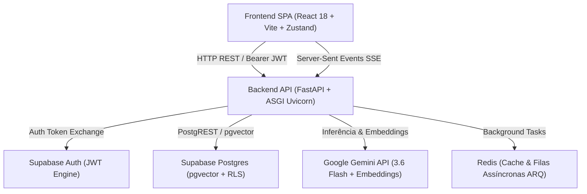
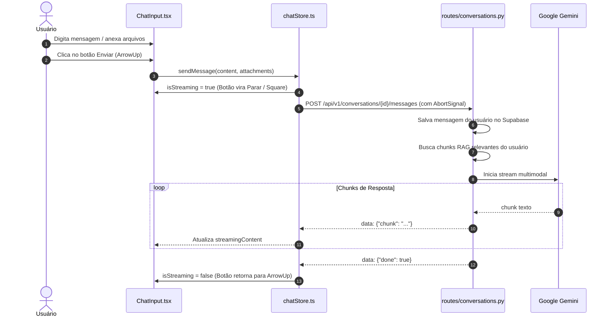
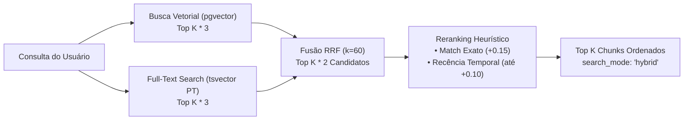

# Documentação Técnica — Plataforma preci.

Este documento provê uma análise técnica aprofundada da arquitetura de software, componentes, contratos de API, fluxo de dados e infraestrutura da plataforma **preci.**

---

## 1. Visão Geral da Arquitetura

A plataforma adota uma arquitetura em camadas orientada a serviços assíncronos (SPA + REST/SSE), com separação estrita de responsabilidades:



### Componentes Principais:
1. **Frontend (SPA)**: React 18 com TypeScript, Vite, TailwindCSS, Framer Motion e Zustand.
2. **Backend (API Core)**: FastAPI com Python 3.11 assíncrono executado sobre Uvicorn ASGI.
3. **Persistência & RAG**: PostgreSQL gerenciado no Supabase, com suporte a extensões `uuid-ossp` e `vector` (pgvector).
4. **Motor Cognitivo (IA)**: Google Gemini SDK oficial (`google-genai` e `google-generativeai`) com fallback resiliente entre modelos.

---

## 2. Autenticação & Segurança Multi-tenant

### 2.1 Fluxo Estrito de Autenticação (Supabase Auth)
- O backend não possui usuários hardcoded, senhas em memória ou backdoors.
- As credenciais enviadas em `POST /api/v1/auth/login` (`username`, `password`) são enviadas diretamente ao serviço de autenticação do Supabase:
  ```http
  POST {SUPABASE_URL}/auth/v1/token?grant_type=password
  apikey: {SUPABASE_ANON_KEY}
  Content-Type: application/json

  {"email": "<username>", "password": "<password>"}
  ```
- **Validação de Retorno**:
  - `200 OK`: O Supabase retorna `access_token` e dados de `user`. O backend sincroniza os metadados com a tabela `public.profiles`, resolvendo o `company_id`.
  - `400/401`: O backend propaga `HTTP 401 Unauthorized` com detalhe "Credenciais inválidas no Supabase".

### 2.2 Isolamento de Dados por Tenant (Company Isolation)
- Todo registro persistido (`conversations`, `messages`, `documents`, `document_folders`, `agents`) é obrigatoriamente referenciado a um `company_id`.
- O middleware de injeção de dependência `get_current_user` em [deps.py](file:///c:/Users/muril/OneDrive/Área de Trabalho/preci.%20company/backend/app/api/deps.py) valida o token JWT em cada requisição e extrai o `user_id` e o `company_id`.
- Consultas no banco são filtradas por `company_id` e pelo `user_id` correspondente, impedindo qualquer vazamento de dados entre usuários ou organizações.

---

## 3. Módulo de Conversas (Chat Multimodal & Streaming)

### 3.1 Ciclo de Envio e Transmissão SSE


### 3.2 Cancelamento de Geração (Stop Generation)
1. **Controle no Frontend**:
   - Enquanto `isStreaming === true`, o botão de envio no [ChatInput.tsx](file:///c:/Users/muril/OneDrive/Área de Trabalho/preci.%20company/frontend/src/components/chat/ChatInput.tsx) é substituído pelo botão de parar (`Square`) **nas mesmas coordenadas exatas**.
   - Ao ser clicado, invoca `stopGeneration()` em [chatStore.ts](file:///c:/Users/muril/OneDrive/Área de Trabalho/preci.%20company/frontend/src/stores/chatStore.ts):
     - Executa `activeAbortController.abort()`.
     - Consolida a mensagem do assistente com `content = streamingContent.trim()`, `is_interrupted = true`.
     - Atualiza o estado da conversa e persiste no `localStorage`.
     - Reseta `isStreaming = false` e `streamingContent = ''`.
2. **Tratamento no Backend**:
   - Em [conversations.py](file:///c:/Users/muril/OneDrive/Área de Trabalho/preci. company/backend/app/api/routes/conversations.py), o gerador assíncrono `sse_generator` intercepta a desconexão via `asyncio.CancelledError`.
   - O conteúdo parcial emitido até aquele milissegundo é salvo no Supabase com metadados de cancelamento (`is_interrupted = True`).
3. **Renderização Visual no Lado da LLM**:
   - Em [ChatMessageList.tsx](file:///c:/Users/muril/OneDrive/Área de Trabalho/preci.%20company/frontend/src/components/chat/ChatMessageList.tsx), a mensagem do assistente detecta `isInterrupted`:
     - Se houver texto parcial: renderiza o markdown do texto e, logo abaixo com borda sutil, exibe o ícone de Stop (`Square`) e a legenda:
       > ⏹ *Envio de mensagem interrompida pelo Usuário*
     - Se não houver texto gerado antes do cancelamento: renderiza um card compacto contendo o aviso.

---

## 4. Módulo de Documentos e RAG (Busca Vetorial)

### 4.1 Estrutura e Navegação
- **Hierarquia de Pastas**: Modelada em `public.document_folders` e gerenciada reativamente via `docStore.ts`.
- **Últimos 5 Documentos Acessados**:
  - Armazenados na store com atualização imediata ao selecionar ou visualizar qualquer arquivo.
  - Exibidos no menu lateral [Sidebar.tsx](file:///c:/Users/muril/OneDrive/Área de Trabalho/preci.%20company/frontend/src/components/layout/Sidebar.tsx).
  - Clique no nome do arquivo: Abre a pasta no File Explorer e destaca a linha.
  - Clique no ícone de Olho (`Eye`): Dispara o preview rápido.

### 4.2 Pop-up de Preview Rápido Exclusivo pelo Ícone de Olho
- **Comportamento Estrito**:
  - O clique no corpo da linha do documento apenas seleciona o item (`selectedDocId`).
  - A abertura do modal de preview rápido ocorre **única e exclusivamente** ao clicar no ícone de Olho (`Eye`).
- **Renderização**:
  - Suporta leitura do texto extraído (`extracted_text`), preview de PDFs e imagens ou metadados de arquivo.
  - Fechamento imediato pelo botão de fechar, clique fora (backdrop) ou tecla `Esc`.

### 4.3 Pipeline de Embeddings & Busca Semântica
1. **Extração de Texto**: PDFs processados com `pypdf.PdfReader` em memória sem gravação de arquivos temporários inseguros no disco.
2. **Chunking**: Função `chunk_text` particiona o conteúdo em blocos de 400 caracteres com sobreposição de 40 caracteres (`overlap`), preservando a continuidade semântica.
3. **Geração de Vetores com Rate Limit**:
   - Cada chunk gera um vetor de 1536 dimensões via `gemini-embedding-2` / `text-embedding-3-small`.
   - O loop inclui espaçamento temporal assíncrono:
     ```python
     if i > 0:
         await asyncio.sleep(0.4)
     ```
     assegurando conformidade com as taxas de limite de requisições por minuto (TPM/RPM) da API.
4. **Scoring de Similaridade & Busca Híbrida**:
   - Integração com o pipeline de busca híbrida e reranking heurístico documentado na seção 4.

---

## 4. Pipeline RAG: Hybrid Search & Reranking

O módulo de recuperação documental da plataforma **preci.** combina busca vetorial semântica profunda com busca textual full-text nativa do PostgreSQL e reranking heurístico leve, garantindo alta precisão sem dependências pesadas de modelos de ML adicionais.



### 4.1 Hybrid Search (pgvector + tsvector nativo)
1. **Modelagem de Dados & Índices**:
   - Coluna `content_tsv tsvector` gerada automaticamente via `to_tsvector('portuguese', content)` com persistência física (`STORED`).
   - Índice de texto invertido `GIN (content_tsv)` para respostas em sub-milissegundos.
   - Índice vetorial `ivfflat (embedding vector_cosine_ops)`.
2. **Execução Concorrente**:
   - Disparo simultâneo via `asyncio.gather` da busca vetorial (similaridade de cosseno pgvector) e busca textual (função RPC `match_document_chunks_fts` com `plainto_tsquery('portuguese', query)`).
   - Coleta ampliada de candidatos ($K \times 3$).
3. **Reciprocal Rank Fusion (RRF, k=60)**:
   - Combinação robusta que independe da escala dos escores individuais:
     $$\text{RRF\_score}(c) = \sum_{r \in \{\text{vector\_rank}, \text{text\_rank}\}} \frac{1}{60 + r}$$
   - Chunks presentes em apenas um dos rankings pontuam com peso proporcional ao rank obtido; chunks presentes em ambos recebem a soma dos pesos, ascendendo ao topo da fila de candidatos.

### 4.2 Reranking Heurístico Pós-Busca
Aplicado sobre os $K \times 2$ melhores candidatos provenientes da fusão RRF:
1. **Match Exato de Palavra-chave (+0.15)**:
   - Detecta termos significativos, códigos contratuais (ex.: `CLI-98234-XP`), números de processo ou nomes próprios presentes literalmente no chunk (ignorando stopwords comuns em português).
2. **Recência Temporal do Documento (até +0.10)**:
   - Decaimento exponencial baseado no timestamp de atualização do documento pai (`updated_at`):
     $$\text{recency\_boost} = 0.10 \times 0.5^{(\text{age\_days} / 90)}$$
   - Documentos recentes recebem pontuação máxima, com meia-vida estipulada em 90 dias.
3. **Score Final Unificado**:
   $$\text{final\_score} = \text{rrf\_score} + \text{keyword\_boost} + \text{recency\_boost}$$

### 4.3 Arquitetura Dual-Mode & Cota Zero
- **Modo Produção (Supabase)**: Utiliza funções RPC dedicadas (`match_document_chunks` e `match_document_chunks_fts`) com isolamento estrito por `company_id`.
- **Modo Local / Cota Zero**: Fallback automático in-memory (`db.documents` e `db.document_chunks`) utilizando tokenização portuguesa nativa e similaridade vetorial via NumPy, garantindo que testes e o fluxo de agentes funcionem perfeitamente sem necessidade de chaves de API ou conexão de rede externa.

---

## 5. Módulo de Agentes (Workflows estilo n8n)

### 5.1 Arquitetura do Canvas, Viewport Plane & Gestão de Estado
- **Canvas com Curvas de Bézier**: O componente [WorkflowCanvas.tsx](file:///c:/Users/muril/OneDrive/Área de Trabalho/preci.%20company/frontend/src/components/agents/WorkflowCanvas.tsx) calcula trajetórias cúbicas suaves para as arestas (`renderEdges`), conecta nós por handles de entrada (esquerda) e saída (direita) e gerencia o ciclo de vida dos blocos no fluxo.
- **Controle de Zoom do Workflow (Canto Inferior Esquerdo)**:
  - O viewport do canvas conta com dimensionamento dinâmico via escala gráfica (`transform: scale(${zoom})`), permitindo enxergar fluxos horizontais e verticais extensos em qualquer resolução de tela.
  - Intervalo de escala de 40% a 200%, com saltos graduais de 10% através dos botões `-` e `+`.
  - Exibição inline da porcentagem ativa (`100%`) com clique direto para redefinir instantaneamente à escala padrão.
  - Botão de redefinição rápida com ícone `RotateCcw` exibido automaticamente quando o zoom for diferente de 100%.
  - Suporte a atalhos de teclado (`Ctrl + / Ctrl - / Ctrl 0`) e atalho de pinça/roda de rolagem com tecla Control (`Ctrl + Wheel`).
- **Marquee Selector & Seleção Desacoplada de Edição**:
  - Clicar no fundo vazio do canvas e arrastar desenha uma caixa de seleção translúcida (`selectionBox`), idêntica à seleção em bloco do desktop operacional ou do Figma.
  - O cálculo de interseção geométrica converte a bounding box do mouse para as coordenadas do mundo (`worldX1, worldY1, worldX2, worldY2`) considerando o nível atual de `zoom`.
  - **Apenas Seleção (Sem Abertura Inadvertida de Modais)**: Nem a caixa de seleção nem o clique simples sobre um nó abrem o modal de configuração. O seletor e o clique apenas adicionam os nós a `selectedNodeIds`, ativando o anel de destaque (`ring-2 ring-neutral-900/40 dark:ring-white/40`) para fins de movimentação e organização no canvas ou exclusão em massa.
  - **Arraste em Grupo**: Ao clicar e arrastar qualquer um dos nós do grupo selecionado, todos os nós selecionados se movem juntos preservando suas distâncias relativas.
  - **Badge de Ações Flutuante com Animação Bidirecional (Entrada e Saída Suaves)**: Ao selecionar nós, o badge surge suavemente deslizando do topo com fade-in e leve escala; ao desmarcar (ou excluir), ele retrai graciosamente para cima enquanto desaparece (`.badge-spring-transition`, 220ms com `cubic-bezier(0.16, 1, 0.3, 1)`), mantendo botões com feedback tátil (`active:scale-95`).
- **Animação Suave de Exclusão de Nós (`<AnimatePresence>`)**:
  - Quando um nó é removido (via tecla `Delete`, lixeira do card ou modal), o container externo executa fade-out da opacidade (`opacity: 1 ➔ 0`) enquanto o card interno executa escala e desfoque suave (`scale: 0.88`, `blur: 3px`, `y: -6px`) ao longo de 200ms, sem conflitar com o posicionamento absoluto do canvas.
- **Cards com Inputs Embutidos & Conexão Direta de Portas**:
  - Cards de 320px com formulários integrados na superfície do canvas.
  - Portas dedicadas por campo (`in:prompt`, `in:query`, `in:raw_data`, `in:body`, `in:value`, `in:to`) conectadas diretamente às saídas dos nós emissores, dispensando escrita manual de fórmulas.
  - Padronização de campos numéricos através do componente `NumberInput.tsx` (variante `chevrons` para modais e `stepper` horizontal para o card RAG).

### 5.2 Pop-up de Configurações Específicas do Nó (`NodeConfigModal.tsx`)
O pop-up é montado dinamicamente com base no nó selecionado (`selectedNodeId`) e no seu tipo (`node.type` e rótulo):
- **Painel Superior de Conexões Ativas**:
  - Exibe os cabos de entrada conectados a cada porta do nó com botão de desconexão rápida em 1 clique (`disconnectHandle`).
  - Lista os nós conectados a jusante nas portas de saída.
- **Isolamento Completo de Eventos & Regras Estritas de Fechamento**:
  - O modal e seu backdrop contam com contenção total de eventos de mouse (`onMouseDown` e `onClick` com `e.stopPropagation()` e `data-no-canvas-select`), garantindo que cliques dentro do modal em áreas que não sejam inputs (como rótulos, botões, sliders, cards e áreas em branco) ou no backdrop **nunca fechem o modal**.
  - O modal é encerrado **estritamente** em 3 cenários intencionais:
    1. Pressionar a tecla **`Escape`**.
    2. Clicar no botão **"Cancelar"** no rodapé.
    3. Clicar no botão **`X`** no canto superior direito do cabeçalho.
    *(além do fechamento automático após salvar com sucesso em "Salvar Configurações")*.
  - Enquanto o modal estiver aberto, os atalhos de teclado do canvas (como `Delete` de nós e zoom) são pausados para evitar interferências com a edição.
- **Cabeçalho Reativo**:
  - Ícone vetorial estilizado com a cor temática do nó.
  - Campo de texto editável com design refinado em cápsula (`rounded-xl`, borda sutil, sombra suave e anel de foco monocromático Preci), idêntico à identidade visual da cápsula de nome do Workflow/Agente.
  - Badge de tipagem técnica e identificador único (`node.id`).
  - Botão de fechar (`X`) e atalho global para a tecla `Escape`.
- **Especializações de Configuração (8 Formulários Exclusivos)**:
  1. `Webhook / Requisição Externa`: Seleção de método HTTP (`POST`, `GET`, `PUT`), exibição de URL gerada dinamicamente (`/api/v1/webhooks/...`) com cópia em 1-clique, Token de autenticação Bearer e exemplo de Payload JSON esperado com status de resposta.
  2. `Disparador Manual`: Campo de instruções de disparo, tabela dinâmica de variáveis de inicialização (`key`, `type`, `default_value`) com botões de adicionar e remover, além de chave de confirmação pré-execução.
  3. `Google Gemini`: Motor de IA fixo Gemini 3.6 Flash (padronizado, sem exibição ou seletor redundante de modelos), System Instructions, editor de prompt com badges indicando portas conectadas, slider de temperatura (0.0 a 1.0) e seletor de formato de saída (Texto/Markdown, JSON).
  4. `Condição Se / Senão`: Campo de entrada de dados, operador relacional (`==`, `!=`, `contains`, `>`, `<`, `is_empty`, `is_not_empty`), valor de referência e visualizador informativo dos ramos Verdadeiro/Falso.
  5. `Iterador em Loop (LoopNode)`: Repetição controlada sobre coleções e arrays com injeção automática de `{{loop.item}}` e `{{loop.index}}`, saídas `loop_body` / `loop_complete`, arestas tracejadas `loop_back` e limite de iterações via stepper.
  6. `Aprovação Humana (HumanApprovalNode)`: Suspensão de execução do pipeline para validação humana, serialização de estado no banco, saídas `approved` / `rejected` e controle de timeout com ação automática.
  7. `Sub-Agente (SubAgentNode)`: Composição modular permitindo reaproveitar outros agentes como blocos reutilizáveis com proteção anti-recursão (profundidade máx. 3).
  8. `Disparo Agendado (ScheduleTrigger)`: Seletor visual humanizado em português ([ScheduleTimePicker.tsx](file:///c:/Users/muril/OneDrive/Área%20de%20Trabalho/preci.%20company/frontend/src/components/agents/ScheduleTimePicker.tsx)) com abas de Frequência (Intervalo, Diário, Dias da Semana, Mensal), tradução em linguagem natural e guardrail de 5 minutos.
  9. `Buscar em Documentos (RAG)`: Consulta semântica de busca, integração reativa com as pastas reais do usuário (`useDocStore.folders`), Top K (1 a 10), threshold de similaridade e alternância de metadados.
  10. `Gerador de Relatórios Corporativos`: Converte dados brutos ou análises da IA em relatórios executivos em HTML corporativo diagramado, com pré-visualização em sandbox isolado nos logs de execução.
  11. `Envio de E-mail Corporativo`: Disparo de relatórios e mensagens via SMTP com porta padronizada via `NumberInput`, autenticação segura e modo de simulação/sandbox.
  12. `Requisição HTTP / API`: Método REST, URL do endpoint de destino, editor estruturado chave/valor de Headers, corpo JSON, controle de Timeout com stepper `NumberInput` e política de retentativas/falha.
- **Rodapé de Ações**:
  - Botão de exclusão com ícone de lixeira (`removeNode`).
  - Botão de cancelamento.
  - Botão de salvar com chamada a `updateNodeConfig`, feedback visual de sucesso e fechamento automático.

### 5.3 Contrato de Dados & Persistência Backend
- **Schema Pydantic**:
  ```python
  class AgentNode(BaseModel):
      id: str
      type: Literal[
          "trigger",
          "ai_model",
          "condition",
          "rag",
          "loop",
          "human_approval",
          "sub_agent",
          "report_generator",
          "email_sender",
          "http_request",
          "action"
      ]
      label: str
      position: Dict[str, float]
      config: Optional[Dict[str, Any]] = {}
  ```
- **Persistência**: Ao salvar no frontend, `updateNodeConfig` atualiza o estado local do Zustand, sincroniza com `localStorage` e despacha `PUT /api/v1/agents/{agent_id}` para salvar os nós e arestas no Supabase.
- **Executor Contextual (`backend/app/services/agents/executor.py`)**: A função `execute_agent_workflow` processa a topologia e injeta os valores configurados nos logs de execução (`model`, `temperature`, `folder_name`, `url`, `method`), proporcionando rastreabilidade total no painel "Testar Fluxo".

### 5.4 Motor de Execução Cognitiva & Testes de Fluxo (Zero Quota / Alta Performance)
- **Execução Real sem Consumo de Cota de API Externa**:
  - Para ambientes de homologação, testes rápidos ou quando as cotas de provedores externos (ex.: Google Gemini) estiverem esgotadas, a plataforma conta com um **motor de inferência cognitiva local e determinística** implementado em Python nativo.
  - Consumo computacional insignificante (< 2 MB de memória RAM, sem necessidade de GPU/VRAM ou binários pesados de LLM local), executando nós com latência inferior a 15ms.
- **Interpolação Dinâmica de Variáveis (`interpolate_text`)**:
  - Conecta nós através de referências expressivas como `{{trigger.pergunta}}`, `{{rag.context}}`, `{{ai_model.output}}`, `{{trigger.cliente}}`.
  - Concatena e propaga o contexto acumulativo entre etapas sucessivas do pipeline.
- **Busca Semântica Local (RAG Documental)**:
  - Localiza trechos pertinentes diretamente na base de dados de documentos e pastas do usuário (`db.documents`), formatando citações reais no contexto da execução.
- **Avaliação Condicional Relacional (`evaluate_condition`)**:
  - Avalia operadores lógicos (`==`, `!=`, `contains`, `>`, `<`, `is_empty`, `is_not_empty`) selecionando automaticamente o ramo verdadeiro ou falso.
- **Inspetor de Execução & Feedback Visual (Frontend)**:
  - **Test Modal (`WorkflowTestModal.tsx`)**: Permite ao desenvolvedor definir variáveis de entrada (`pergunta`, `cliente`, `prioridade`) com presets rápidos ("Suporte ao Cliente", "Análise de Contrato", "Consulta Interna").
  - **Rastreamento Visual no Canvas**: Ao disparar o teste, o nó em execução no momento acende no canvas com anel esmeralda pulsante (`border-emerald-500 ring-4 ring-emerald-500/40 shadow-emerald-500/30 animate-pulse`).
  - **Inspetor em 3 Abas (`ExecutionLogsModal.tsx`)**:
    1. *Resultado Gerado*: Markdown/JSON final renderizado com métricas de tempo e botão de cópia em 1-clique.
    2. *Inspetor de Nós (I/O)*: Lista interativa com cada bloco do fluxo, exibindo snapshots JSON exatos de entrada (`input`) e saída (`output`), latência em ms e status individual.
    3. *Logs do Workflow*: Terminal de telemetria detalhada de cada etapa da execução.

---

## 6. Design System & Diretrizes de UI

- **Cores Oficiais**:
  - Dark: `#131313` / `#171717`, Texto `#F5F5F5` / `#FFFFFF`.
  - Light: `#EFEFEF` / `#F5F5F5`, Texto `#171717` / `#0A0A0A`.
- **Tipografia**: Família **Satoshi**, com variação Semi-bold na grafia da marca `preci.`.
- **Sem Emojis**: Todo ícone da interface deve provir exclusivamente de **Lucide React** ou SVGs oficiais.
- **Sidebar Dinâmica**:
  - Altura natural para até 10 conversas e até 5 agentes.
  - Rolagem vertical independente ativada automaticamente a partir do 11º item nas conversas e do 6º item nos agentes.
  - Botões de Ação Rápida (`+`) simétricos nos cabeçalhos de **Conversas** (cria nova conversa), **Agentes** (cria novo agente) e **Documentos** (abre modal de upload).
  - Botão de Documentos permanentemente visível (`shrink-0`).

---

## 7. Scripts e Comandos de Operação

### Execução no Windows (1-Click)
O arquivo [start.bat](file:///c:/Users/muril/OneDrive/Área%20de%20Trabalho/preci.%20company/start.bat) na raiz inicia o ecossistema completo em janelas separadas:
```cmd
start.bat
```
- **Backend (FastAPI)**: Servidor ASGI em `http://127.0.0.1:8000` com documentação interativa em `/docs`. Inicia automaticamente no `lifespan` o **Agendador em Memória (`start_in_memory_scheduler`)**, permitindo disparos cron contínuos sem dependência forçada de Redis no ambiente local.
- **Frontend (Vite)**: Servidor de desenvolvimento React em `http://localhost:5173`.
- **Fila Distribuída (Opcional)**: Caso utilize Redis e queira processar workers separados:
  ```cmd
  cd backend
  python -m arq app.workers.worker.WorkerSettings
  ```

### Execução Manual
- **Backend**:
  ```cmd
  cd backend
  python -m uvicorn app.main:app --host 127.0.0.1 --port 8000 --reload
  ```
- **Frontend**:
  ```cmd
  cd frontend
  npm run dev
  ```

### Docker Compose
```bash
docker-compose up --build
```
- Frontend mapeado na porta `5173`.
- Backend FastAPI mapeado na porta `8000`.
- Worker ARQ e Redis em segundo plano.
