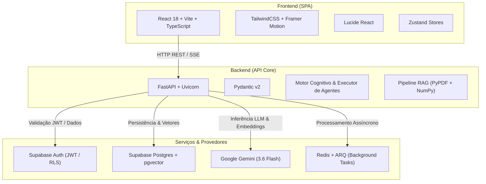

# Stack Tecnológica — Plataforma preci.

Este documento detalha a stack tecnológica completa da plataforma **preci.**, explicando o propósito de cada componente, biblioteca, serviço e ferramenta utilizada no sistema.

---

## 1. Visão Geral da Arquitetura

A plataforma **preci.** é um ecossistema corporativo completo de Inteligência Artificial composto por três pilares principais:
1. **Chat Multimodal & Streaming**: Interface de chat com streaming em tempo real via Server-Sent Events (SSE), suporte a anexos (PDFs, imagens) e cancelamento instantâneo.
2. **Gestão Documental & RAG (Retrieval-Augmented Generation)**: Extração de texto de documentos corporativos em pastas virtuais, geração de embeddings vetoriais e busca semântica para alimentar o contexto das respostas.
3. **Módulo de Agentes (Workflows estilo n8n)**: Criação e edição visual de pipelines de automação e agentes de IA em um canvas interativo com curvas de Bézier, marquee selection, controles de zoom e motor de execução local/cognitivo de alta performance.

---

## 2. Frontend (Interface do Usuário)

Localizado no diretório `/frontend`, construído como uma Single Page Application (SPA) moderna, ultra veloz e focada em design limpo e responsivo.

| Tecnologia / Biblioteca | Versão | Para que serve no sistema? |
| :--- | :--- | :--- |
| **React** | `18.3.1` | Biblioteca base para a construção da interface do usuário baseada em componentes reativos. |
| **TypeScript** | `^5.6.3` | Garante tipagem estática rigorosa no frontend, prevenindo erros de runtime e oferecendo autocompletar em modelos de nós, mensagens e documentos. |
| **Vite** | `^5.4.9` | Bundler e servidor de desenvolvimento ultra-rápido via ESM nativo, com Hot Module Replacement (HMR) instantâneo para recarregamento do código sem perder o estado. |
| **TailwindCSS** | `^3.4.14` | Framework CSS utilitário para estilização rápida, suporte nativo ao Modo Claro/Escuro (`dark:`), design system minimalista monocromático da Preci e responsividade fluida. |
| **PostCSS & Autoprefixer** | `^8.4.47` / `^10.4.20` | Pré-processamento e injeção automática de prefixos de compatibilidade cross-browser para regras CSS modernas. |
| **Framer Motion** | `^11.11.9` | Biblioteca de animações declarativas. Utilizada para transições suaves de modais, pop-ups, gavetas de nós (`NodeDrawer`), alertas e badges flutuantes. |
| **Lucide React** | `^0.453.0` | Conjunto oficial de ícones SVG consistentes da plataforma. Substitui totalmente o uso de emojis na interface corporativa. |
| **Zustand** | `^5.0.0` | Gerenciador de estado global leve e reativo. Controla com alto desempenho stores isoladas: `chatStore` (mensagens e streaming), `agentStore` (canvas de nós e workflows), `docStore` (arquivos, pastas e preview), `authStore` (sessão e tokens) e `themeStore` (dark/light). |
| **React Markdown** | `^10.1.0` | Renderizador de texto formatado (Markdown) nas respostas do assistente de IA, blocos de código, listas, tabelas e citações. |
| **Remark GFM** | `^4.0.1` | Plugin para o React Markdown que adiciona suporte a GitHub Flavored Markdown (tabelas, listas de tarefas, links automáticos e tachados). |
| **Canvas Gráfico Nativo** | SVG + React | Motor de renderização visual de grafos para workflows, com curvas Bézier cúbicas, handles direcionais e suporte a aceleração por hardware GPU (`translate3d`). |
| **NumberInput** | Componente Próprio | Componente numérico padronizado com steppers verticais (`chevrons`) e horizontais (`stepper`), erradicando os controles nativos do navegador e caixas brancas em Dark Mode. |

---

## 3. Backend (API Core & Lógica de Negócios)

Localizado no diretório `/backend`, construído em Python moderno com arquitetura assíncrona orientada a serviços e alta taxa de transferência.

| Tecnologia / Biblioteca | Versão | Para que serve no sistema? |
| :--- | :--- | :--- |
| **Python** | `3.11+` | Linguagem de programação principal do backend, escolhida por seu excelente ecossistema assíncrono e suporte nativo ao ecossistema de dados e IA. |
| **FastAPI** | `0.115.0` | Framework web assíncrono de altíssima performance para construção de APIs REST e endpoints de streaming (SSE). Gera documentação interativa automática (OpenAPI/Swagger). |
| **Uvicorn** | `0.30.6` | Servidor web ASGI (Asynchronous Server Gateway Interface) de produção responsável por executar a aplicação FastAPI com recarregamento em tempo real (`--reload`). |
| **Pydantic & Pydantic-Settings** | `2.9.2` / `2.5.2` | Validação de dados de entrada/saída, tipagem de contratos JSON e parsing/validação de variáveis de ambiente do arquivo `.env`. |
| **HTTPX** | `0.27.2` | Cliente HTTP assíncrono de alto desempenho. Utilizado para chamadas externas (ex.: nó de `Requisição HTTP / API` nos agentes e comunicação com APIs de terceiros). |
| **PyPDF** | `>=5.0.0` | Leitura e extração de texto bruto a partir de arquivos PDF enviados pelos usuários para a base de conhecimento (sem necessidade de gravar arquivos temporários em disco). |
| **NumPy** | `>=1.26.0` | Biblioteca de computação numérica utilizada para cálculo ultrarrápido de similaridade de cosseno entre os vetores de embedding nas buscas semânticas (RAG). |
| **Python-Multipart** | `0.0.9` | Suporte no FastAPI para recebimento de requisições `multipart/form-data`, viabilizando o upload direto de arquivos e documentos no chat e no repositório. |

---

## 4. Inteligência Artificial & Provedores Cognitivos

A plataforma implementa uma camada desacoplada de IA com suporte a inferência remota em nuvem e inferência local:

| Componente | Detalhes | Para que serve no sistema? |
| :--- | :--- | :--- |
| **Google Gemini SDK** (`google-genai` / `google-generativeai`) | `v0.8.2` / `>=0.1.0` | SDK oficial da Google para comunicação com a API do Gemini. Realiza a inferência generativa, suporte multimodal (leitura de texto e imagens anexadas) e streaming de tokens. |
| **Modelo Padrão: Gemini 3.6 Flash** | `gemini-3.6-flash` | Modelo de linguagem unificado da plataforma (utilizado tanto no Chat quanto nos Nós de IA dos Agentes). Oferece equilíbrio ideal entre raciocínio rápido, grande janela de contexto e baixa latência. |
| **Embeddings Semânticos** | `gemini-embedding-2` / `text-embedding-3-small` | Gera vetores numéricos densos de 1536 dimensões para os trechos de texto extraídos dos documentos corporativos. |
| **Motor Cognitivo Local & Determinístico (Zero Quota)** | `/backend/app/services/agents/executor.py` | Motor de inferência em Python nativo que permite testar e executar workflows complexos de agentes **sem consumir cotas de APIs externas** e com latência inferior a 15ms. Orquestra a execução topológica de 8 tipos de nós: `trigger`, `ai_model`, `rag`, `condition`, `report_generator`, `email_sender`, `http_request` e `action`, com passagem direta de dados por cabos e injeção em portas receptoras. |

---

## 5. Banco de Dados, Autenticação & RAG (Supabase)

A camada de persistência central da aplicação é alimentada pelo **Supabase**:

| Recurso | Detalhes | Para que serve no sistema? |
| :--- | :--- | :--- |
| **Supabase Client Python** | `supabase==2.7.4` | Biblioteca client oficial em Python para comunicação direta com a API do Supabase (PostgREST, Auth e Storage). |
| **PostgreSQL** | `v15+` | Banco de dados relacional principal. Armazena perfis de usuários, empresas (tenants), conversas, mensagens, documentos, pastas virtuais, nós e arestas dos agentes. |
| **Extensão `pgvector`** | `vector` | Permite armazenar vetores de embedding e executar buscas vetoriais de vizinhos mais próximos (KNN com distância cosseno) diretamente via SQL. |
| **Supabase Auth** | JWT Engine & RLS | Autenticação centralizada com emissão de tokens JWT seguros. O backend valida cada requisição garantindo isolamento total por `company_id` (arquitetura multi-tenant segura). |
| **Supabase Storage** | Buckets de Arquivos | Armazenamento de arquivos binários (PDFs, imagens e anexos) enviados pelos usuários no chat ou no repositório de documentos. |

---

## 6. Mensageria Assíncrona, Cache & Workers

Para tarefas computacionais que não devem bloquear as requisições HTTP do usuário (como processamento em lote de documentos e indexação assíncrona):

| Tecnologia | Versão | Para que serve no sistema? |
| :--- | :--- | :--- |
| **Redis** | `7-alpine` | Banco de dados em memória chave-valor ultraveloz. Atua como broker de mensagens, gerenciador de filas assíncronas e cache de sessões. |
| **ARQ (Async Redis Queue)** | `0.26.1` | Gerenciador de tarefas em segundo plano (background workers) baseado em asyncio e Redis. Processa filas de tarefas assíncronas em paralelo ao servidor FastAPI. |
| **Redis Python Client** | `5.0.8` | Biblioteca de conexão e manipulação direta do Redis a partir do código Python. |

---

## 7. Infraestrutura, Containerização & Scripts

| Ferramenta / Arquivo | Para que serve no sistema? |
| :--- | :--- |
| **Docker & Docker Compose** | Arquivo `docker-compose.yml` que orquestra os containers de Frontend, Backend, Worker ARQ e Redis em uma rede bridge privada (`preci-network`). |
| **`start.bat`** | Script de inicialização facilitada no Windows. Com um clique duplo, abre duas janelas de terminal iniciando o backend Uvicorn (porta 8000) e o frontend Vite (porta 5173). |
| **Environment Configuration (`.env`)** | Centraliza todas as chaves e segredos da aplicação: URLs do Supabase, Anon Key, Service Role Key, Gemini API Key, portas e conexões Redis. |

---

## 8. Resumo da Topologia de Portas

| Serviço | Porta | Descrição |
| :--- | :--- | :--- |
| **Frontend (Vite)** | `5173` | Interface Web acessada no navegador (`http://localhost:5173`) |
| **Backend (FastAPI)** | `8000` | API REST e SSE (`http://localhost:8000`) |
| **Documentação da API** | `8000/docs` | Swagger UI com todos os endpoints do sistema |
| **Redis** | `6379` | Broker de mensagens e filas de tarefas |
| **Supabase** | Nuvem / 54322 | Banco de dados Postgres gerenciado e Autenticação JWT |
